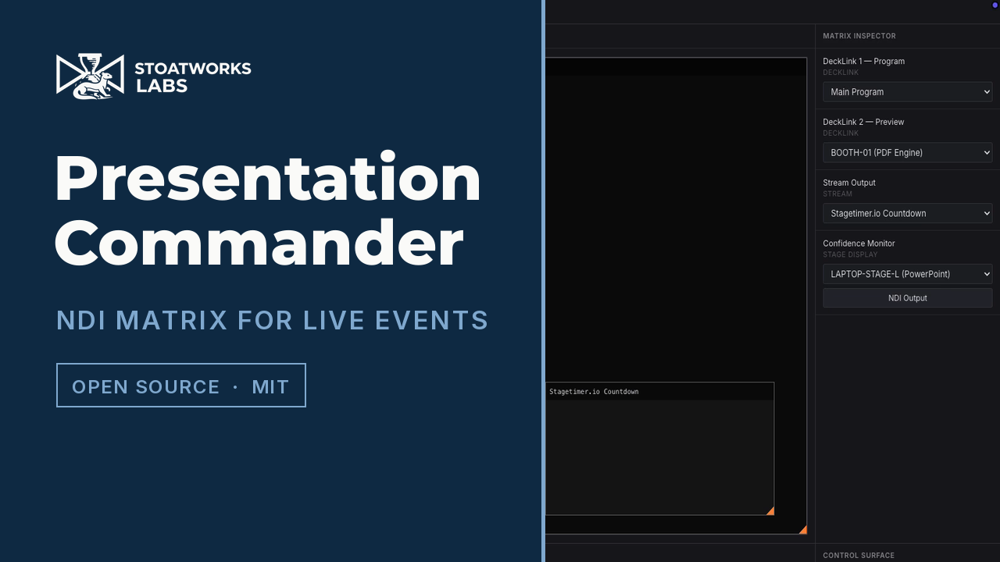
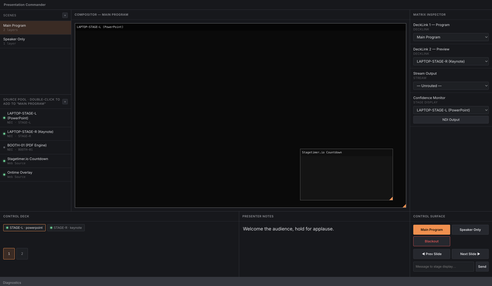
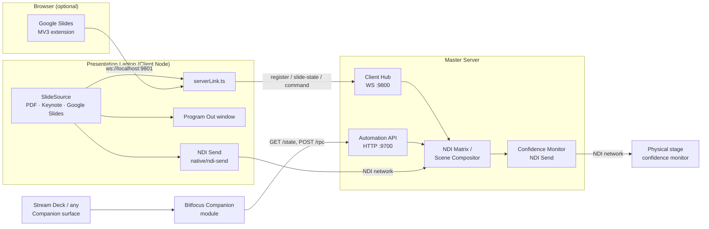

# Presentation Commander — Server

> **AI-assisted project.** This codebase was created with [Claude](https://claude.com/claude-code)
> (Anthropic), directed and reviewed by a human author — including architecture,
> implementation, and documentation. Review it accordingly before relying on it in
> production.

The master control application for live event production: a real-time NDI
video matrix router, layered scene compositor, and presenter-notes hub,
built as an Electron + React + TypeScript desktop app.

Pairs with [presentation-commander-client](https://github.com/stoatworks-labs/presentation-commander-client),
the companion app that runs on each presentation laptop.

[](https://www.youtube.com/watch?v=sTzrCB5XlY8)

*A 43-second tour. Every frame is the real application, recorded on screen and driven over
the automation API on `:9700` — the same endpoint the Companion module uses. It runs on the
shipped demo data, and does not show a presentation laptop paired to the server.*



<!-- downloads:start -->

## Download

**[v1.0.2](https://github.com/stoatworks-labs/presentation-commander-server/releases/tag/v1.0.2)** — prebuilt for macOS, Windows and Linux. Pick your platform:

<details>
<summary><b>macOS</b> — Apple Silicon, Intel</summary>

| Build | Download | Size |
| --- | --- | --- |
| Apple Silicon · .dmg disk image | [`presentation-commander-server-1.0.2-arm64.dmg`](https://github.com/stoatworks-labs/presentation-commander-server/releases/download/v1.0.2/presentation-commander-server-1.0.2-arm64.dmg) | 129 MB |
| Intel · .dmg disk image | [`presentation-commander-server-1.0.2-x64.dmg`](https://github.com/stoatworks-labs/presentation-commander-server/releases/download/v1.0.2/presentation-commander-server-1.0.2-x64.dmg) | 136 MB |
| Apple Silicon · .pkg installer | [`presentation-commander-server-1.0.2-macos-arm64.pkg`](https://github.com/stoatworks-labs/presentation-commander-server/releases/download/v1.0.2/presentation-commander-server-1.0.2-macos-arm64.pkg) | 129 MB |
| Intel · .pkg installer | [`presentation-commander-server-1.0.2-macos-x64.pkg`](https://github.com/stoatworks-labs/presentation-commander-server/releases/download/v1.0.2/presentation-commander-server-1.0.2-macos-x64.pkg) | 136 MB |
| Apple Silicon · .zip archive | [`Presentation.Commander.Server-1.0.2-arm64-mac.zip`](https://github.com/stoatworks-labs/presentation-commander-server/releases/download/v1.0.2/Presentation.Commander.Server-1.0.2-arm64-mac.zip) | 125 MB |
| Intel · .zip archive | [`Presentation.Commander.Server-1.0.2-mac.zip`](https://github.com/stoatworks-labs/presentation-commander-server/releases/download/v1.0.2/Presentation.Commander.Server-1.0.2-mac.zip) | 132 MB |

</details>

<details>
<summary><b>Windows</b> — x64 & ARM64, x64, ARM64</summary>

| Build | Download | Size |
| --- | --- | --- |
| x64 & ARM64 · .exe installer | [`presentation-commander-server-1.0.2-setup.exe`](https://github.com/stoatworks-labs/presentation-commander-server/releases/download/v1.0.2/presentation-commander-server-1.0.2-setup.exe) | 219 MB |
| x64 · .exe installer | [`presentation-commander-server-1.0.2-x64-setup.exe`](https://github.com/stoatworks-labs/presentation-commander-server/releases/download/v1.0.2/presentation-commander-server-1.0.2-x64-setup.exe) | 112 MB |
| ARM64 · .exe installer | [`presentation-commander-server-1.0.2-arm64-setup.exe`](https://github.com/stoatworks-labs/presentation-commander-server/releases/download/v1.0.2/presentation-commander-server-1.0.2-arm64-setup.exe) | 108 MB |
| x64 & ARM64 · portable .exe | [`presentation-commander-server-1.0.2-portable.exe`](https://github.com/stoatworks-labs/presentation-commander-server/releases/download/v1.0.2/presentation-commander-server-1.0.2-portable.exe) | 219 MB |
| x64 · portable .exe | [`presentation-commander-server-1.0.2-x64-portable.exe`](https://github.com/stoatworks-labs/presentation-commander-server/releases/download/v1.0.2/presentation-commander-server-1.0.2-x64-portable.exe) | 112 MB |
| ARM64 · portable .exe | [`presentation-commander-server-1.0.2-arm64-portable.exe`](https://github.com/stoatworks-labs/presentation-commander-server/releases/download/v1.0.2/presentation-commander-server-1.0.2-arm64-portable.exe) | 107 MB |
| x64 · .zip archive | [`Presentation.Commander.Server-1.0.2-win.zip`](https://github.com/stoatworks-labs/presentation-commander-server/releases/download/v1.0.2/Presentation.Commander.Server-1.0.2-win.zip) | 148 MB |
| ARM64 · .zip archive | [`Presentation.Commander.Server-1.0.2-arm64-win.zip`](https://github.com/stoatworks-labs/presentation-commander-server/releases/download/v1.0.2/Presentation.Commander.Server-1.0.2-arm64-win.zip) | 148 MB |

</details>

<details>
<summary><b>Linux</b> — x64, ARM64</summary>

| Build | Download | Size |
| --- | --- | --- |
| x64 · .deb package (Debian/Ubuntu) | [`presentation-commander-server_1.0.2_amd64.deb`](https://github.com/stoatworks-labs/presentation-commander-server/releases/download/v1.0.2/presentation-commander-server_1.0.2_amd64.deb) | 109 MB |
| ARM64 · .deb package (Debian/Ubuntu) | [`presentation-commander-server_1.0.2_arm64.deb`](https://github.com/stoatworks-labs/presentation-commander-server/releases/download/v1.0.2/presentation-commander-server_1.0.2_arm64.deb) | 104 MB |
| x64 · .rpm package (Fedora/RHEL) | [`presentation-commander-server-1.0.2.x86_64.rpm`](https://github.com/stoatworks-labs/presentation-commander-server/releases/download/v1.0.2/presentation-commander-server-1.0.2.x86_64.rpm) | 85 MB |
| ARM64 · .rpm package (Fedora/RHEL) | [`presentation-commander-server-1.0.2.aarch64.rpm`](https://github.com/stoatworks-labs/presentation-commander-server/releases/download/v1.0.2/presentation-commander-server-1.0.2.aarch64.rpm) | 80 MB |
| x64 · AppImage | [`presentation-commander-server-1.0.2-x86_64.AppImage`](https://github.com/stoatworks-labs/presentation-commander-server/releases/download/v1.0.2/presentation-commander-server-1.0.2-x86_64.AppImage) | 134 MB |
| ARM64 · AppImage | [`presentation-commander-server-1.0.2-arm64.AppImage`](https://github.com/stoatworks-labs/presentation-commander-server/releases/download/v1.0.2/presentation-commander-server-1.0.2-arm64.AppImage) | 134 MB |

</details>

All builds, checksums and release notes: [github.com/stoatworks-labs/presentation-commander-server/releases](https://github.com/stoatworks-labs/presentation-commander-server/releases).

These builds are unsigned, so macOS and Windows each warn once on first launch — see [Unsigned builds — Gatekeeper, SmartScreen & Defender Firewall](#unsigned-builds--gatekeeper-smartscreen--defender-firewall) for the one-time fix.

<!-- downloads:end -->

## What it does

- **Source Pool** — add/edit/delete NDI and web sources, or pick a real NDI
  sender discovered live on the network (mDNS `_ndi._tcp.local`)
- **Scenes** — layered scene compositor: build scenes from multiple layered
  sources, drag to reposition, drag a corner to resize, toggle visibility.
  Layers backed by a real network source show a **live video preview**
  rendered from actual received NDI frames, not a placeholder box
- **Matrix Inspector** — route any physical/stream/stage output to a source
  or a full composited scene
- **Control Deck** — live presenter notes and slide position per connected
  Client Node
- **Control Surface** — a button-grid control surface: scene recall, blackout,
  next/previous slide, send-note-to-stage — all backed by the same command
  path used by the JSON-RPC automation API (`:9700`), which also powers the
  [Bitfocus Companion module](https://github.com/stoatworks-labs/companion-module-presentationcommander-server)
  for Stream Deck integration
- **Confidence Monitor** — a `Presenter Notes` source type composites live
  presenter notes over video into one real NDI output (`native/ndi-send`,
  the same addon architecture as the Client's NDI send), so a physical
  stage monitor gets an actual broadcast signal instead of a text box in
  the operator's own window
- **Client Hub** (`:9800`) — WebSocket server that Client Nodes register
  with; connected clients automatically appear as routable sources, and
  next/previous-slide commands are forwarded live to the client instead of
  being simulated locally

## Architecture



## What's real vs. mocked

NDI **discovery and receive are real**, built directly against the official
[Vizrt NDI SDK](https://ndi.video/for-developers/ndi-sdk/) via a small
native N-API addon (`native/ndi-receive`) — no third-party NDI wrapper.
Source discovery uses mDNS; the scene compositor's layer previews are
actual decoded video frames pulled from the network with
`NDIlib_recv_capture_v3`. DeckLink capture cards and other physical
broadcast hardware are still out of scope — this project has no way to
test against hardware it doesn't have.

### Building from source

The native receive addon links against the NDI SDK at build time. Install
the [NDI SDK](https://ndi.video/for-developers/ndi-sdk/) first (macOS
default: `/Library/NDI SDK for Apple`; override the location with
`NDI_SDK_DIR` if yours lives elsewhere). `npm install` rebuilds the addon
automatically via `@electron/rebuild`.

## Documentation

| Doc | Contents |
|---|---|
| [docs/USER-GUIDE.md](docs/USER-GUIDE.md) | Operating it: sources, scenes, routing, client nodes, troubleshooting — and what is real vs. mocked |
| [docs/API.md](docs/API.md) | Automation API (`:9700`), Client Hub protocol (`:9800`), domain model, IPC channels |
| [docs/DEVELOPING.md](docs/DEVELOPING.md) | Setup, the NDI SDK build dependency, packaging traps, architecture |

Two things worth knowing before a show, both covered in the user guide: **nothing is
persisted** — quitting discards every source, scene and route — and the app starts with
**demo data** that looks like a configured rig but isn't.

## Roadmap / TODO

- [ ] **Physical capture hardware** — DeckLink capture cards and other broadcast I/O are currently out of scope; the project has no way to test against hardware it doesn't have. NDI discovery/receive and the compositor are real (see "What's real vs. mocked" above).

## Project Setup

### Install

```bash
npm install
```

### Development

```bash
npm run dev
```

### Build

```bash
# Windows
npm run build:win

# macOS
npm run build:mac

# Linux
npm run build:linux
```

## Unsigned builds — Gatekeeper, SmartScreen & Defender Firewall

The release binaries are **not code-signed or notarized** — that needs paid Apple
and Microsoft developer certificates this project doesn't carry. The downloads are
fine; the OS just can't identify the publisher, so it warns you the first time.

- **macOS** — *"cannot be opened because the developer cannot be verified"*.
  Right-click the app → **Open** → **Open**, or clear the flag:
  `xattr -dr com.apple.quarantine "/Applications/presentation-commander-server.app"`
- **Windows** — SmartScreen shows *"Windows protected your PC"* →
  **More info** → **Run anyway**.
- **Windows Defender Firewall** — first launch pops *"Allow Presentation Commander
  Server to communicate on these networks"*. Tick **Private** (and **Domain** on a
  managed network) — Presentation Commander Server needs it to serve its JSON-RPC
  control API and route NDI video. Deny it and clients, Companion and the automation API
  will all fail to connect.
- **Linux** — no signing gate.

Per-artifact steps, self-signing, checksum verification and the Defender Firewall reset
procedure: **[docs/UNSIGNED.md](docs/UNSIGNED.md)**.

## Recommended IDE Setup

- [VSCode](https://code.visualstudio.com/) + [ESLint](https://marketplace.visualstudio.com/items?itemName=dbaeumer.vscode-eslint) + [Prettier](https://marketplace.visualstudio.com/items?itemName=esbenp.prettier-vscode)

## Trademarks and third-party licences

**NDI® is a registered trademark of Vizrt NDI AB.** See <https://ndi.video>.
This project is not affiliated with or endorsed by Vizrt.

The NDI runtime is obtained separately under Vizrt's own terms and is not
redistributed here. NDI Tools are not redistributed either — get them from
<https://ndi.video/tools>.

H.264, H.265 and AAC are separately licensable formats. The NDI SDK grant does
not cover them, and the obligation sits with whoever ships a product using them.
